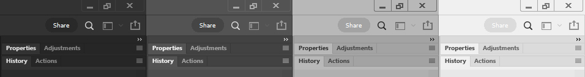
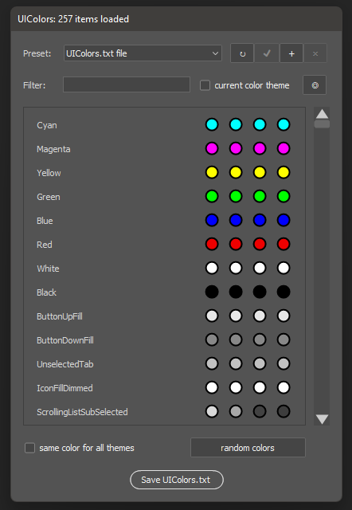
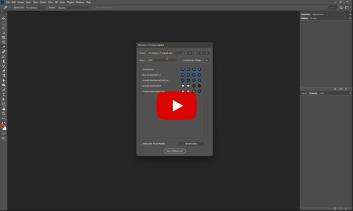

# Share button tweak for Photoshop 23.2.2 and above

> ### Using a pre-generated interface colors file

Download [UIColors.txt](UIColors.txt) file and copy it to your Photoshop directory:

* **Windows**: `c:\Program Files\Adobe\Adobe Photoshop 2022\Adobe Photoshop 2022\Required\UIColors.txt`
* **MacOS**: Programs -> Adobe Photoshop 2022 -> find app icon, open context menu and select 'Show Package Contents', then move saved file to the `/Contents/Required/UIColors.txt`

Restart Photoshop.

**Do not forget to backup your original UIColors.txt**

> ### Generate your own interface colors file with script

Download [UIcolors.jsx](UIcolors.jsx) script file and copy it to `Presets\Scripts\` folder of Photoshop

Restart Photoshop - script will appear in the application scripts menu.

